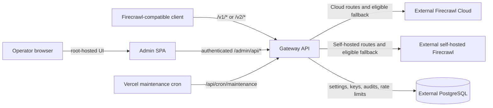

# Firecrawl Gateway

Firecrawl Gateway is an independently deployed gateway for operators who use Firecrawl Cloud, an external self-hosted Firecrawl deployment, or both. It provides one API boundary for compatible Firecrawl requests, routing controls, global virtual API keys, and an operator dashboard for settings and audit data.

This repository is a separate gateway application, not Firecrawl or PostgreSQL. It does not host either service, manage their infrastructure, or claim official affiliation. Upstream availability, feature compatibility, account access, and billing remain the responsibility of the relevant external service.

## Why this exists

Operators may want to keep existing Firecrawl-compatible clients pointed at one gateway origin while deciding where eligible work should run. This project is intended to make that boundary explicit:

- route requests to an external self-hosted Firecrawl instance, Firecrawl Cloud, or an eligible fallback;
- issue `fc_`-prefixed virtual API keys to clients while keeping the single administrator's credentials environment-backed;
- configure upstream Cloud keys and routing policy from the admin dashboard; and
- inspect request outcomes, backend choice, fallback behavior, status, and latency in PostgreSQL-backed audit data.

The gateway is useful when self-hosted capacity and Cloud capabilities need different operational treatment, but it is not a promise of full upstream feature parity. Requests that require Cloud-managed behavior still need Cloud, and sensitive or private requests are subject to stricter fallback rules.

## Architecture

The Bun-workspace Turborepo contains two independently deployable Vercel projects:

- `apps/api` — a native NestJS API on the Fastify adapter. It authenticates virtual API keys, applies route policy, proxies `/v1/*` and `/v2/*`, and exposes health, readiness, administration, and maintenance routes.
- `apps/admin` — a root-hosted React/Vite admin SPA. It calls authenticated `/admin/api/*` endpoints on the API and does not run under an `/admin` URL prefix.



The self-hosted Firecrawl URL is configured in the admin UI. Cloud API keys are encrypted in PostgreSQL. PostgreSQL is also the source for global settings, API keys, audit logs, and shared rate-limit state; the repository does not add a file-based audit store.

## Routing and operational boundaries

The configured default route mode can be one of:

- `self-hosted-first` — use the external self-hosted instance first and fall back to Cloud for eligible requests.
- `self-hosted-only` — never send requests to Cloud; Cloud-required requests are rejected.
- `cloud-first` — use Cloud first and fall back to self-hosted when an eligible, non-Cloud-required request cannot use the configured Cloud credit pool.
- `cloud-only` — use Cloud exclusively.

Some paths and request options require Cloud-managed behavior, including examples such as agent, browser, monitor, research, and Fire-engine-backed actions. The gateway routes those requests to Cloud when possible and rejects them in `self-hosted-only` mode. Fallback is policy-controlled rather than a generic retry: the self-hosted-first path does not fall back when sensitive upstream headers or cookies, sensitive body headers, or private target URLs are present.

The API's security and runtime boundaries are deliberate:

- With authentication enabled, clients send a virtual API key as a Bearer token. Plaintext is returned only when a key is created; store it securely.
- The single administrator is configured with `ADMIN_EMAIL` and `ADMIN_PASSWORD`; those credentials are not stored in PostgreSQL. Admin sessions use signed HTTP-only cookies.
- `ADMIN_ORIGIN` and `API_ORIGIN` should be exact deployed origins for credentialed CORS; do not use `*` for this setup.
- Request bodies are inspected and forwarded as UTF-8 JSON. Binary uploads and Latin-1 text can be corrupted in transit, so this gateway is not a general binary proxy.
- The API function is configured for up to 120 seconds, subject to the Vercel plan's maximum. The daily maintenance cron permanently removes audit entries older than 30 days.
- Prisma migrations are not applied during API startup. The single-admin cutover is destructive and requires explicit approval; see [`RELEASING.md`](RELEASING.md) and [`SELF_HOST.md`](SELF_HOST.md).

## Quick start

```bash
bun install
cp .env.example .env
bun run db:generate
bun run db:migrate
bun run dev
```

The API listens on `http://localhost:8080`. Set `VITE_API_BASE_URL` to that API origin when running the admin locally. The migration command requires a migration-capable direct PostgreSQL connection and must be run only after reviewing the migration warning above.

## Deploy

Create two Vercel projects with roots `apps/api` and `apps/admin`. Each root contains its own `vercel.json`:

- API: configure the variables in `.env.example`, including `DATABASE_URL`, `CRON_SECRET`, the encryption/session secrets, and the single-admin credentials. Set optional `REDIS_URL` to enable shared per-key estimated-credit reservations; without it, the API uses local key rotation.
- Admin: configure `VITE_API_BASE_URL` to the API's exact origin.
- Configure exact `ADMIN_ORIGIN` and `API_ORIGIN` values so credentialed CORS is restricted.
- Verify Prisma migrations separately before starting or redeploying the API. Do not assume Vercel builds or the typecheck workflow apply migrations.

Vercel deployment is separate from GitHub Actions: the repository workflow only runs `bun run typecheck` for pull requests and pushes to `main`. Use [`RELEASING.md`](RELEASING.md) for release and deployment verification, and [`QUICKSTART.md`](QUICKSTART.md) for the full setup sequence.

## Documentation

- [`QUICKSTART.md`](QUICKSTART.md) — local development and Vercel setup
- [`SELF_HOST.md`](SELF_HOST.md) — external Firecrawl and PostgreSQL configuration
- [`apps/api/README.md`](apps/api/README.md) — API routes and Prisma operations
- [`docs/DESIGN.md`](docs/DESIGN.md) — admin UI design rules
- [`CONTRIBUTING.md`](CONTRIBUTING.md) — development and pull request guidance
- [`SUPPORT.md`](SUPPORT.md) — non-sensitive support and issue routing
- [`SECURITY.md`](SECURITY.md) — vulnerability reporting and secret hygiene
- [`RELEASING.md`](RELEASING.md) — version, tag, release, and deployment checklist
- [`CODE_OF_CONDUCT.md`](CODE_OF_CONDUCT.md) — community participation standards
- [`CHANGELOG.md`](CHANGELOG.md) — unreleased repository changes
