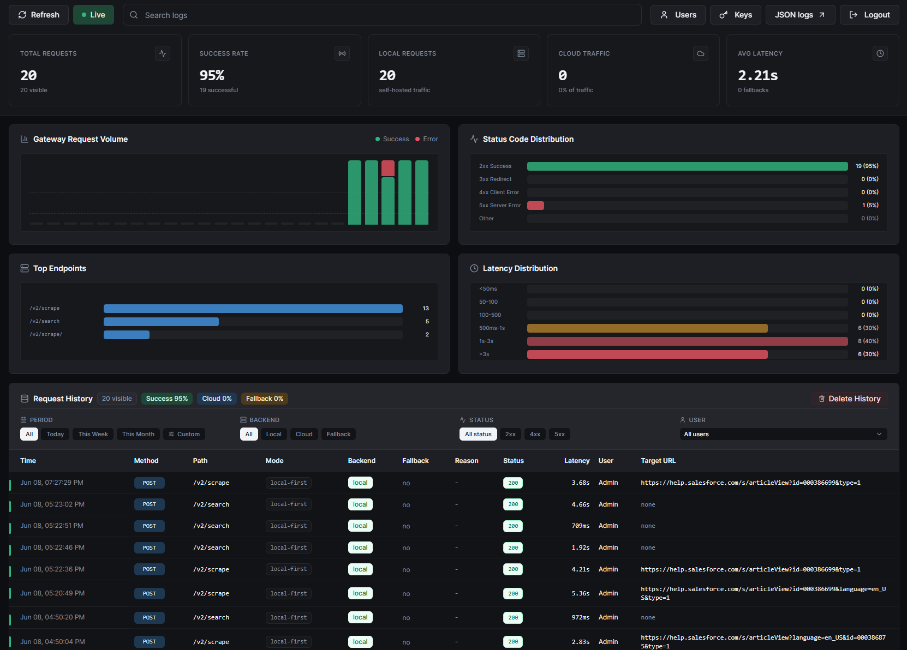

# Hybrid Firecrawl Self-host

This repository orchestrates official Firecrawl container images behind an intelligent Hybrid Gateway that routes requests between your local instance and Firecrawl Cloud based on feature availability and your configured policy.

**Why Hybrid?** Core scraping, crawling, parsing, and supported output formats run locally at no cost. Managed features—actions, agent extraction, browser sessions, monitoring, and more—are seamlessly forwarded to Firecrawl Cloud. You get the best of both worlds without managing two separate integrations.

## Quick Start

```bash
cp .env.example .env
# Edit .env, then:
docker compose up -d --build
```

Default endpoints:

- Gateway API: `http://localhost:8080`
- Admin UI: `http://localhost:8080/admin` when `AUTH_ENABLED=true` (default)
- Direct local API: `http://localhost:3002`

## Admin Dashboard

The included web dashboard provides real-time visibility into request routing, success rates, latency metrics, and traffic distribution between local and cloud backends. Access it at `http://localhost:8080/admin` when authentication is enabled.



## What Is Included

- `docker-compose.yaml` — Firecrawl self-host services
- `gateway/` — Hybrid Gateway (Express.js + React admin UI)
- `.env.example` — environment variables
- `SELF_HOST.md` — deployment guide
- `LICENSE`

## Architecture

```text
            Client
              |
              v
        Hybrid Gateway
       |              |
       |              |
 (local-safe)   (cloud-only or fallback)
       |              |
       v              v
  Self-hosted    Firecrawl Cloud
```

## Documentation

- [`SELF_HOST.md`](SELF_HOST.md) — full deployment, configuration, and troubleshooting
- [`gateway/README.md`](gateway/README.md) — gateway development, routes, and policy
